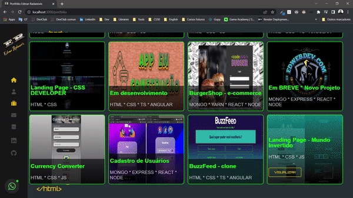

# Portfolio Edmar Radanovis

<h2>Finished personal portfolio project</h2>
 
=> Result of the finished project. The purpose here was to create a website where I present the collection of all my projects, finished or in progress.
   It was a very fun APP to develop, where I realized the knowledge of various tools and perfected several soft skills.
   Highlight for animations and responsive layout.
 
 

 

 
 

 <a href="https://edwebdev.vercel.app/" >Click here to try it out .. thanks for your interest!</a>
 
( Select Ctrl + click for open in new tab )

  
  

### Adjustments and improvements

The project was fully completed and some of the resources used were:

- [x] 
- [x] 
- [x] 
- [x] 
- [x] 
- [x] 
- [x] 
- [x] 
- [x] 

## 🤝 Collaborators

<table>
  <tr>
    <td align="center">
      <a href="https://www.linkedin.com/in/edmar-radanovis-0130b611a/">
         
      
        <b>Edmar Radanovis</b>
      
      </a>
    </td>
    <td align="center">
      <a href="https://www.freecodecamp.org/">
         
      
        <b>FreeCodeCamp</b>
      
      </a>
    </td>
    <td align="center">
      <a href="https://www.patreon.com/CodewithSloba">
         
      
        <b>Slobodan Gajić</b>
      
      </a>
    </td>
  </tr>
</table>

[⬆ Voltar ao topo](#portfolio-edmar-radanovis) 
